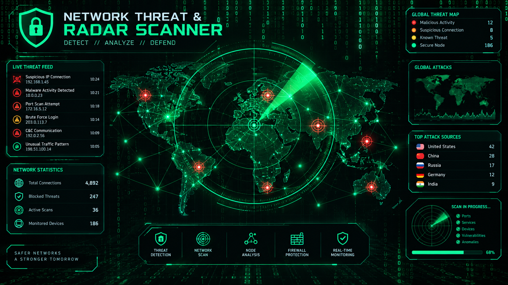

# CyberBullet


**CyberBullet** is a desktop security toolkit that brings together a set of common defensive-security utilities in one dashboard. Built with Python and [CustomTkinter](https://github.com/TomSchimansky/CustomTkinter), it's designed for learning, local diagnostics, and authorized testing on your own network and machines.


## Features

- **Dashboard** — at-a-glance security score, device/threat/port/scan counters
- **Network Scanner** — threaded ping sweep of your local subnet with reverse-DNS hostname lookup
- **Wi-Fi Scanner** — nearby wireless network overview
- **Port Scanner** — Nmap-backed TCP port scan against a target you specify
- **IP / Host Info** — resolve hostnames and look up IP details
- **Password Analyzer** — local password-strength scoring (nothing is transmitted)
- **Phishing / URL Analyzer** — basic heuristic checks on a URL (HTTPS use, host anomalies, etc.)
- **File Integrity** — generate and compare SHA-256 hashes for files you control
- **Log Analyzer** — scan a local log file for common security-relevant patterns
- **Safe Ransomware Simulator** — defensive training demo that only touches harmless sandbox files, never real user data
- **Scan History & Reports** — session history and exportable text reports

## Screenshots

_Add screenshots or a short demo GIF here._

## Requirements

- Python 3.13+
- [CustomTkinter](https://pypi.org/project/customtkinter/)
- [Nmap](https://nmap.org/) installed and available on your system `PATH` (required for the Port Scanner module)

## Installation

```bash
git clone https://github.com/<your-username>/cyberbullet.git
cd cyberbullet
pip install -r requirements.txt
```

## Usage

```bash
python main.py
```

On Windows, you can also run `Create_CyberBullet_Desktop_Shortcut.ps1` in PowerShell to add a desktop shortcut that launches the app directly.

## Project Structure

```
cyberbullet/
├── main.py                          # Main application entry point
├── core/
│   └── network_scanner.py           # Local network discovery module
├── Create_CyberBullet_Desktop_Shortcut.ps1
├── requirements.txt
└── README.md
```

## Responsible Use

CyberBullet's scanning and analysis tools are intended for use on **networks, hosts, and files you own or are explicitly authorized to test**. Do not use the Port Scanner, Network Scanner, or any other module against systems without permission.

## Roadmap

- [ ] Persist scan history and reports between sessions
- [ ] Expand phishing/URL heuristics
- [ ] Add packaged builds (PyInstaller) for Windows/macOS/Linux
- [ ] Unit tests for core modules

## License

This project is licensed under the MIT License — see the [LICENSE](LICENSE) file for details.

## Contributing

Contributions are welcome. Open an issue to discuss a change before submitting a pull request.
